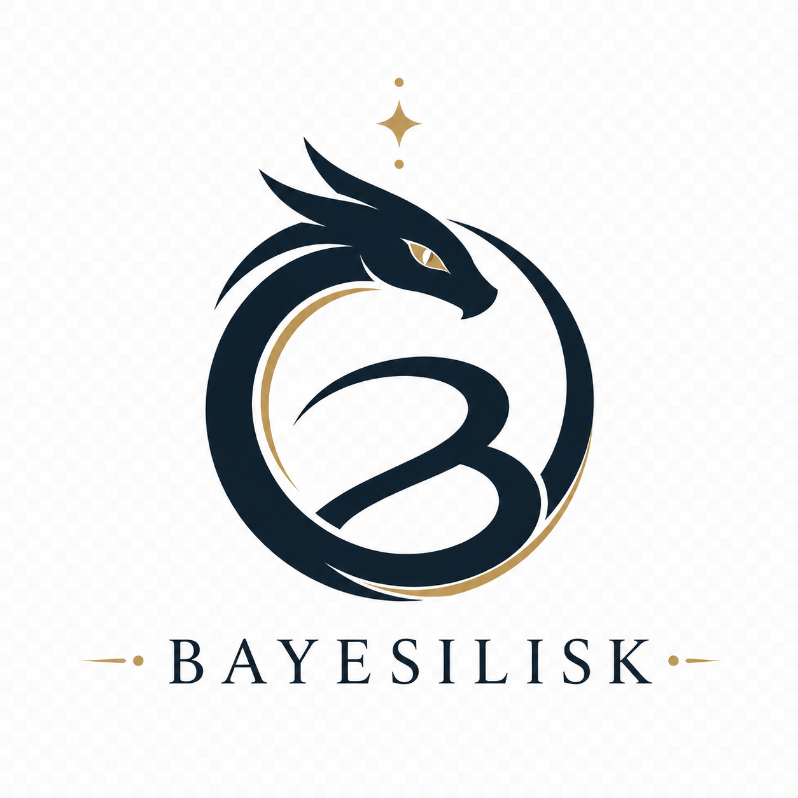
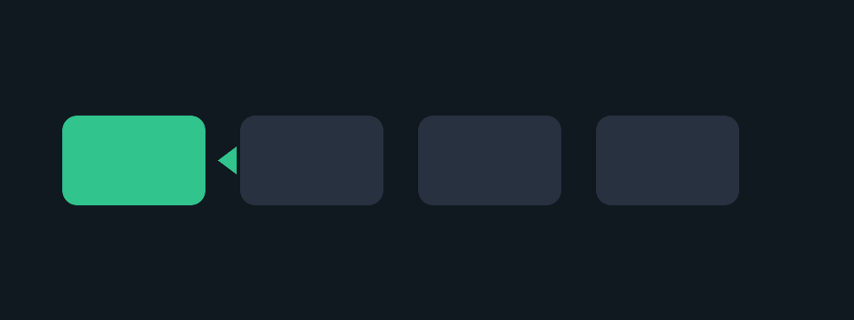

# Bayesilisk

[](https://github.com/sashakolpakov/bayesilisk/actions/workflows/ci.yml)

<p align="center">
  
</p>

**Beyond E2E Scripts: Using LLM-Proposed Scenarios Without Letting the LLM Be the Oracle.**

Bayesilisk is a deterministic local layer for permission, entitlement, route,
and data-boundary sitting over Playwright, with Grassmann attention, and
LLM-generated scenario-proposal workflows gated by a finite-state verifier.

Bayesilisk is intentionally local-first. It uses static scenario fragments,
caller-provided context, optional observation history, optional browser evidence,
and optional local model proposals. It does not connect to production systems or
inspect live customer data. It is built for testers and agents that need
reproducible findings without granting a model authority over the final verdict.

## What It Is

Bayesilisk is designed to find "bad spots" in authorization and data-boundary
logic before those gaps become hard-to-debug application bugs.

It checks scenarios involving:

- permission and role-route matrices;
- customer module entitlements;
- expense approval and receipt evidence;
- billing export access;
- HR document access boundaries;
- support takeover sessions;
- DMS tenant and process boundaries;
- travel funding and travel-expense consistency.

The core verifier is deterministic:

```text
scenario facts -> invariant checks -> pass/fail -> Bayesian ranking
```

No embedding, model output, issue text, or Playwright observation can directly
declare a bug. Those layers can only steer where Bayesilisk looks next.

See [DESIGN.md](DESIGN.md) for the governing architecture:

```text
Playwright is the sensor.
Grassmann attention is the router.
The scenario proposer model is the proposer.
Bayesilisk is the judge.
```

## Quick Start

Run the CLI from the repository root:

```sh
python3 -m bayesilisk --seed 150 --format json
python3 -m bayesilisk --seed 150 --format markdown --output /tmp/bayesilisk.md
python3 -m bayesilisk --seed 150 --context /tmp/bayesilisk-context.json --issue-payloads
```

After installation, the same entry points are available as:

```sh
bayesilisk --seed 150 --format json
bayesilisk-mcp
```

Run the test suite:

```sh
python3 -m pytest
```

GitHub CI runs deterministic tests and the Sphinx docs build without Ollama,
hosted models, browser services, or hidden local state:

```sh
python3 -m pytest -m "not live_playwright and not live_ollama"
sphinx-build -b html docs docs/_build/html
```

Live browser/model checks are local opt-in tests:

```sh
python3 -m pytest tests/test_live_integrations.py -m live_playwright -rs
BAYESILISK_LIVE_OLLAMA=1 python3 -m pytest tests/test_live_integrations.py -m live_ollama -rs
```

## Reports

Reports include:

- seed and tool version;
- deterministic production-access boundary;
- scenario fragments and generated sub-scenarios;
- access patterns;
- expected invariant and observed result;
- stable fingerprint and dedupe key;
- classification and issue readiness;
- attention score and attention reasons when context is supplied;
- posterior probability and risk score;
- suggested issue title and body.

Only findings with:

```text
observedResult = fail
issueReadiness = ready-for-issue
```

should be opened automatically. `probe-only`, `regression-watch`,
`do-not-open-muted`, and `no-issue-control` findings are intentionally not
automatic issue material.

## Proof Artifacts



The proof loop is deliberately split:

```text
Playwright evidence -> Grassmann attention -> model proposal -> Bayesilisk verification -> issue payload
```

Example artifacts:

- [example JSON report](docs/examples/example-report.json)
- [example GitHub issue payloads](docs/examples/example-issue-payloads.json)

### Why This Is Not a Black Box

Bayesilisk exposes separate ledgers for `observedByPlaywright`,
`selectedByGrassmannAttention`, `proposedByModel`, and `verifiedByBayesilisk`.
Only `verifiedByBayesilisk` contains deterministic invariant results that can
feed issue payloads. Model output remains untrusted candidate input.

### Model Unavailable? Still Works

The default verifier path requires no model provider. With no Ollama or hosted
model configured, Bayesilisk still composes deterministic scenarios, evaluates
finite-state invariants, ranks findings, validates report schemas, and emits
issue payloads from verified failures.

## Microsoft Playwright Bridge

Bayesilisk includes a local workflow pressure demo and an optional Microsoft
Playwright probe. Playwright observes concrete browser behavior and writes
Bayesilisk context; Bayesilisk still performs deterministic verification
afterward.

Install the optional browser dependency:

```sh
python3 -m pip install -e '.[playwright]'
python3 -m playwright install chromium
```

Run the bundled demo probe:

```sh
bayesilisk-demo
bayesilisk-demo --recording
python3 tools/playwright_probe.py --demo --output /tmp/bayesilisk-playwright-context.json
python3 -m bayesilisk --seed 150 --context /tmp/bayesilisk-playwright-context.json --format markdown
python3 -m bayesilisk --seed 150 --context /tmp/bayesilisk-playwright-context.json --issue-payloads
```

`bayesilisk-demo` serves a synthetic local fixture defined in
`bayesilisk/demo.py::DEMO_PROBES`. Those rows are not claims about an existing
customer app; they are twelve deliberately brittle product-like workflows across
Travel, Expenses, Billing, HR, Support, and DMS, with stale state, impossible
ordering, duplicate submission, feature-flag exposure, tenant boundaries, two
controls, and role lanes. Its output shows the chain: Playwright evidence ->
Grassmann plane -> generated catalog/attention scenarios -> optional
model-style proposal -> deterministic verdict -> issue payload. Use
`bayesilisk-demo --recording` to open headed Chromium, slow the probe clicks, and
hold the browser long enough to screen-record the local workflow pressure. Use
`bayesilisk-demo --no-playwright` to see the same local loop without launching a
browser. The transcript explains every finding class: `breakage.easy`,
`breakage.hard-to-find`, `finding.candidate-breakage`, and
`control-confirmed`. `breakage.hard-to-find` means the deterministic invariant
failed only after context narrowed the search to a cross-role, cross-module,
stale-state, or unusual workflow path; it does not mean the model guessed the
verdict.

For a real app, serve a page that exposes `data-bayesilisk-probe` rows with
actor, route, invariant, expected status, and actual click behavior, then run:

```sh
python3 tools/playwright_probe.py --url http://localhost:3000/probe-page \
  --output /tmp/bayesilisk-real-context.json
python3 -m bayesilisk --seed 150 --context /tmp/bayesilisk-real-context.json --format markdown
```

## Grassmann Attention

Contextual reports include a bounded Grassmann-style attention layer. It treats
Playwright observations, repository facts, issue text, and invariant descriptions
as local context planes, then scores which planes look bad or under-tested.

By default this uses a dependency-free anchor-plane proxy. Set
`BAYESILISK_USE_OLLAMA_EMBEDDINGS=1` to add Ollama `/api/embed` similarities with
`BAYESILISK_OLLAMA_MODEL`, defaulting to `nomic-embed-text`.

The same behavior can be controlled explicitly from the CLI:

```sh
python3 -m bayesilisk --seed 150 --context /tmp/bayesilisk-playwright-context.json \
  --enable-embeddings \
  --embedding-model nomic-embed-text \
  --attention-threshold 0.4 \
  --attention-selection-limit 3
```

Attention scores answer:

```text
Where should Bayesilisk look next?
```

Risk scores answer:

```text
Given this deterministic rule result, how important is this finding?
```

Those are deliberately separate.

## Scenario Proposer Model

Set `BAYESILISK_USE_OLLAMA_SCENARIO_MODEL=1` to let a local scenario proposer
model suggest extra scenario compositions through Ollama `/api/chat`.
The provider is selected with `BAYESILISK_SCENARIO_PROVIDER`, defaulting to
`ollama`. API-key backed providers read keys from `BAYESILISK_SCENARIO_API_KEY`
or the env var named by `BAYESILISK_SCENARIO_API_KEY_ENV`; reports record only
whether a key was configured, never the key itself.
Runtime config precedence is explicit CLI/MCP arguments, then environment
variables, then defaults.

The preferred local proposer is `gemma4:e2b`:

```sh
BAYESILISK_USE_OLLAMA_SCENARIO_MODEL=1 \
BAYESILISK_OLLAMA_SCENARIO_MODEL=gemma4:e2b \
python3 -m bayesilisk --seed 150 --context /tmp/bayesilisk-playwright-context.json --format json
```

Equivalent CLI controls avoid hidden environment-only behavior:

```sh
python3 -m bayesilisk --seed 150 --context /tmp/bayesilisk-playwright-context.json \
  --enable-scenario-proposer \
  --scenario-provider ollama \
  --scenario-model gemma4:e2b \
  --scenario-proposal-limit 3 \
  --ollama-base-url http://localhost:11434
```

Model output is untrusted. Bayesilisk accepts a proposal only if it uses known
fragment ids and invariant ids, targets a selected attention plane, and passes
schema validation. Accepted proposals appear as `generated.model.*` scenarios
with `weak-model-proposal:*` provenance for compatibility with the earlier
report field name.

Every JSON report includes `effectiveConfiguration`, recording the effective
attention/model settings with the Ollama base URL reduced to a safe URL class.

## MCP Server

Bayesilisk includes a small stdio MCP tool server:

```sh
python3 -m bayesilisk.mcp_server
```

It exposes:

- `bayesilisk.run`;
- `bayesilisk.rank_context`;
- `bayesilisk.issue_payloads`.

The MCP tools accept the same control names as JSON arguments, including
`enableEmbeddings`, `embeddingModel`, `enableScenarioProposer`,
`scenarioModel`, `scenarioProposalLimit`, `attentionThreshold`,
`attentionSelectionLimit`, and `ollamaBaseUrl`.

Agents should pass current issue lists, open PRs, branch facts, local verifier
notes, Playwright observations, and known Bayesilisk fingerprints as context.
The MCP server still runs locally and does not mutate GitHub or production
systems.

## Documentation

Sphinx documentation lives in [docs/](docs/). The GitHub Pages workflow builds it
with MyST Markdown support and publishes it from GitHub Actions.

Local docs build:

```sh
python3 -m pip install -r docs/requirements.txt
sphinx-build -b html docs docs/_build/html
```

## Development Notes

The test suite includes scenario-matrix coverage:

- every catalog scenario must reference valid fragments and invariants;
- every invariant must have at least one passing control and one failing
  bad-spot case in the deterministic catalog;
- Playwright, Grassmann attention, and model proposals must not override
  finite-state verifier results.

Current public planning issues are tracked in GitHub Issues.

## Boundaries

Bayesilisk is a verifier and prioritizer, not an authorization engine. It must
not connect to production systems, inspect live customer data, create migrations,
or emit internal platform claims as customer package claims.
